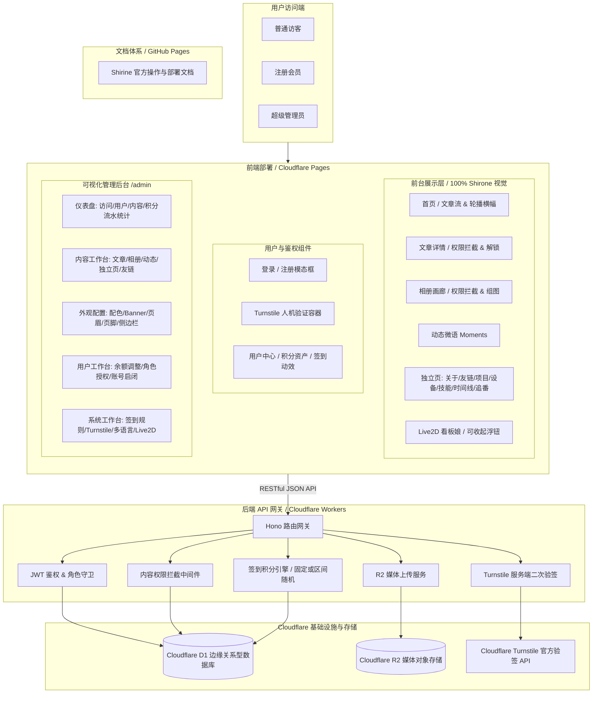
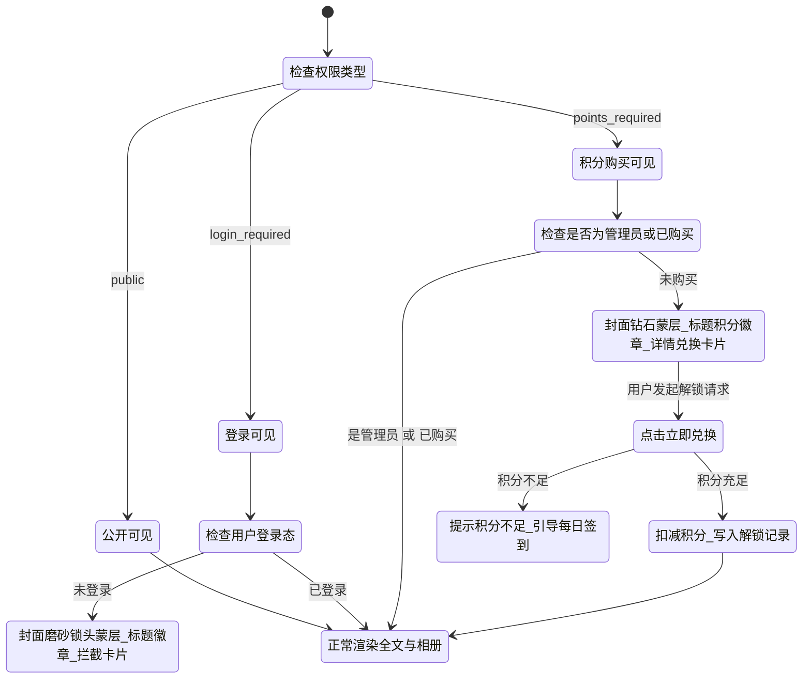

# Shirine 超级全栈博客系统：全链路深度改造与工程实施方案

---

## 目录
1. [项目总览与核心规范](#一项目总览与核心规范)
2. [总体架构设计与边缘拓扑](#二总体架构设计与边缘拓扑)
3. [后端服务与 D1 数据库设计（server/）](#三后端服务与-d1-数据库设计server)
4. [用户体系与积分签到引擎（核心模块 1）](#四用户体系与积分签到引擎核心模块-1)
5. [三级内容权限控制系统（核心模块 2）](#五三级内容权限控制系统核心模块-2)
6. [全量可视化后台管理系统（核心模块 3）](#六全量可视化后台管理系统核心模块-3)
7. [Cloudflare Turnstile 人机安全验证（核心模块 4）](#七cloudflare-turnstile-人机安全验证核心模块-4)
8. [多语言国际化 i18n 全覆盖（核心模块 5）](#八多语言国际化-i18n-全覆盖核心模块-5)
9. [Mizuki Live2D 看板娘全站集成（核心模块 6）](#九mizuki-live2d-看板娘全站集成核心模块-6)
10. [前端 100% 视觉复用与数据层动态化（client/）](#十前端-100-视觉复用与数据层动态化client)
11. [Rin 规格官方文档与 GitHub Pages（docs/）](#十一rin-规格官方文档与-github-pagesdocs)
12. [CI/CD 自动化部署与 GitHub 仓库交付](#十二cicd-自动化部署与-github-仓库交付)
13. [工程实施步骤与验证矩阵](#十三工程实施步骤与验证矩阵)

---

## 一、项目总览与核心规范

### 1. 项目定位
将原生静态主题 **Shirone**（Astro + Svelte 5 + Tailwind 4）全量重构为基于 **Cloudflare 免费生态**（Cloudflare Pages + Workers + D1 + R2 + Turnstile）的动态全栈博客系统 **`Shirine`**。
- **100% 视觉与交互复用**：保留 Shirone 原生的 Material 3 Expressive 质感、HCT 算法动态配色、Swup 无感平滑切页、卡片流式布局、多套动态背景纹理（starlight, cyber-dots, topography, geometric, sakura）、Expressive Code 代码折叠与高亮、KaTeX 数学公式、Mermaid 图表渲染。
- **数据源动态化升级**：将静态本地 Markdown 文件与 yaml 配置文件，全面替换为运行时调用 **Cloudflare Workers RESTful API + D1 数据库**，实现全前台动态获取与全后台可视化管理。
- **参考开源项目融合**：
  - 架构与部署体系：参考 **Rin**（前后端分离、Drizzle ORM、D1 数据库迁移、R2 存储、GitHub Actions 自动化 CI/CD）。
  - 看板娘组件：参考 **Mizuki** 与 **live2d-widget**（iframe 隔离沙箱、动作交互、多端适配、管理端与访客端独立开关）。
  - 人机验证机制：参考 **SkyMail Turnstile**（动态非侵入式加载、二次服务端验签）。

### 2. 严格规范要求
1. **品牌唯一规范**：全站全链路唯一品牌为 **`Shirine`**。任何前台标题、管理后台、代码标识、配置字段、页脚版权、文档中均不得出现混淆品牌。
2. **磁盘隔离规范**：所有产出文件**严格且仅存储于当前项目工作区 `d:\MiMo Desktop\项目\1\Shirine`**，严禁向 C 盘写入任何业务或配置代码。
3. **交付仓库**：最终全量源码推送到 GitHub 仓库 `https://github.com/yiran168/Shirine`。

---

## 二、总体架构设计与边缘拓扑



---

## 三、后端服务与 D1 数据库设计（`server/`）

### 1. 核心依赖与脚手架
- **基础环境**：Cloudflare Workers (Runtime), TypeScript 5.6+
- **网络框架**：`hono` 4.6+（路由、全局异常捕获、CORS、Cookie 解析、中间件流水线）
- **数据库工具**：`drizzle-orm` 0.35+ + `drizzle-kit`（类型安全 D1 操作与迁移）
- **鉴权加密**：`jose` 5.9+（JWT 签名、HS256 验签）、Web Crypto API（SHA-256 加盐散列）
- **对象存储对接**：`aws4fetch` 与 Cloudflare R2 Binding

### 2. D1 数据库完整 12 表实体设计

```sql
-- 1. 用户表
CREATE TABLE IF NOT EXISTS users (
  id INTEGER PRIMARY KEY AUTOINCREMENT,
  username TEXT NOT NULL UNIQUE,
  password_hash TEXT NOT NULL,
  salt TEXT NOT NULL,
  role TEXT NOT NULL DEFAULT 'user', -- 'superadmin' | 'user'
  avatar TEXT DEFAULT '',
  nickname TEXT DEFAULT '',
  points INTEGER NOT NULL DEFAULT 0,
  status TEXT NOT NULL DEFAULT 'active', -- 'active' | 'banned'
  last_checkin_date TEXT, -- YYYY-MM-DD
  checkin_streak INTEGER NOT NULL DEFAULT 0,
  created_at INTEGER NOT NULL DEFAULT (unixepoch()),
  updated_at INTEGER NOT NULL DEFAULT (unixepoch())
);
CREATE INDEX IF NOT EXISTS users_username_idx ON users(username);

-- 2. 每日签到记录表
CREATE TABLE IF NOT EXISTS checkin_records (
  id INTEGER PRIMARY KEY AUTOINCREMENT,
  user_id INTEGER NOT NULL REFERENCES users(id) ON DELETE CASCADE,
  checkin_date TEXT NOT NULL, -- YYYY-MM-DD
  points_awarded INTEGER NOT NULL,
  created_at INTEGER NOT NULL DEFAULT (unixepoch()),
  UNIQUE(user_id, checkin_date)
);
CREATE INDEX IF NOT EXISTS checkin_user_idx ON checkin_records(user_id);

-- 3. 博客文章表
CREATE TABLE IF NOT EXISTS posts (
  id INTEGER PRIMARY KEY AUTOINCREMENT,
  slug TEXT NOT NULL UNIQUE,
  alias TEXT,
  permalink TEXT,
  title TEXT NOT NULL,
  description TEXT NOT NULL DEFAULT '',
  content TEXT NOT NULL,
  image TEXT NOT NULL DEFAULT '',
  category TEXT NOT NULL DEFAULT '',
  tags TEXT NOT NULL DEFAULT '[]', -- JSON 字符串数组
  pinned INTEGER NOT NULL DEFAULT 0,
  draft INTEGER NOT NULL DEFAULT 0,
  comment_enabled INTEGER NOT NULL DEFAULT 1,
  permission_type TEXT NOT NULL DEFAULT 'public', -- 'public' | 'login_required' | 'points_required'
  required_points INTEGER NOT NULL DEFAULT 0,
  encrypted INTEGER NOT NULL DEFAULT 0,
  password TEXT DEFAULT '',
  password_hint TEXT DEFAULT '',
  hide_home_content INTEGER NOT NULL DEFAULT 1,
  uid INTEGER NOT NULL REFERENCES users(id),
  created_at INTEGER NOT NULL DEFAULT (unixepoch()),
  updated_at INTEGER NOT NULL DEFAULT (unixepoch())
);
CREATE INDEX IF NOT EXISTS posts_slug_idx ON posts(slug);
CREATE INDEX IF NOT EXISTS posts_perm_idx ON posts(permission_type);
CREATE INDEX IF NOT EXISTS posts_date_idx ON posts(created_at);

-- 4. 文章积分解锁表
CREATE TABLE IF NOT EXISTS post_unlocks (
  id INTEGER PRIMARY KEY AUTOINCREMENT,
  user_id INTEGER NOT NULL REFERENCES users(id) ON DELETE CASCADE,
  post_id INTEGER NOT NULL REFERENCES posts(id) ON DELETE CASCADE,
  points_spent INTEGER NOT NULL,
  created_at INTEGER NOT NULL DEFAULT (unixepoch()),
  UNIQUE(user_id, post_id)
);

-- 5. 相册表
CREATE TABLE IF NOT EXISTS albums (
  id INTEGER PRIMARY KEY AUTOINCREMENT,
  title TEXT NOT NULL,
  description TEXT NOT NULL DEFAULT '',
  cover TEXT NOT NULL DEFAULT '',
  permission_type TEXT NOT NULL DEFAULT 'public', -- 'public' | 'login_required' | 'points_required'
  required_points INTEGER NOT NULL DEFAULT 0,
  draft INTEGER NOT NULL DEFAULT 0,
  uid INTEGER NOT NULL REFERENCES users(id),
  created_at INTEGER NOT NULL DEFAULT (unixepoch()),
  updated_at INTEGER NOT NULL DEFAULT (unixepoch())
);

-- 6. 相册照片表
CREATE TABLE IF NOT EXISTS album_photos (
  id INTEGER PRIMARY KEY AUTOINCREMENT,
  album_id INTEGER NOT NULL REFERENCES albums(id) ON DELETE CASCADE,
  url TEXT NOT NULL,
  title TEXT DEFAULT '',
  description TEXT DEFAULT '',
  sort_order INTEGER NOT NULL DEFAULT 0,
  created_at INTEGER NOT NULL DEFAULT (unixepoch())
);
CREATE INDEX IF NOT EXISTS album_photos_album_idx ON album_photos(album_id);

-- 7. 相册积分解锁表
CREATE TABLE IF NOT EXISTS album_unlocks (
  id INTEGER PRIMARY KEY AUTOINCREMENT,
  user_id INTEGER NOT NULL REFERENCES users(id) ON DELETE CASCADE,
  album_id INTEGER NOT NULL REFERENCES albums(id) ON DELETE CASCADE,
  points_spent INTEGER NOT NULL,
  created_at INTEGER NOT NULL DEFAULT (unixepoch()),
  UNIQUE(user_id, album_id)
);

-- 8. 动态微语 Moments 表
CREATE TABLE IF NOT EXISTS moments (
  id INTEGER PRIMARY KEY AUTOINCREMENT,
  content TEXT NOT NULL,
  location TEXT DEFAULT '',
  mood TEXT DEFAULT '', -- Iconify 图标名，如 material-symbols:sentiment-excited-outline-rounded
  images TEXT NOT NULL DEFAULT '[]', -- JSON: [{ src, alt }]
  tags TEXT NOT NULL DEFAULT '[]',
  pinned INTEGER NOT NULL DEFAULT 0,
  draft INTEGER NOT NULL DEFAULT 0,
  uid INTEGER NOT NULL REFERENCES users(id),
  created_at INTEGER NOT NULL DEFAULT (unixepoch()),
  updated_at INTEGER NOT NULL DEFAULT (unixepoch())
);

-- 9. 自定义独立页面表
CREATE TABLE IF NOT EXISTS pages (
  id INTEGER PRIMARY KEY AUTOINCREMENT,
  slug TEXT NOT NULL UNIQUE,
  title TEXT NOT NULL,
  content TEXT NOT NULL,
  draft INTEGER NOT NULL DEFAULT 0,
  uid INTEGER NOT NULL REFERENCES users(id),
  created_at INTEGER NOT NULL DEFAULT (unixepoch()),
  updated_at INTEGER NOT NULL DEFAULT (unixepoch())
);

-- 10. 友情链接表
CREATE TABLE IF NOT EXISTS friends (
  id INTEGER PRIMARY KEY AUTOINCREMENT,
  name TEXT NOT NULL,
  desc TEXT DEFAULT '',
  avatar TEXT NOT NULL,
  url TEXT NOT NULL,
  accepted INTEGER NOT NULL DEFAULT 1,
  sort_order INTEGER NOT NULL DEFAULT 0,
  uid INTEGER NOT NULL REFERENCES users(id),
  created_at INTEGER NOT NULL DEFAULT (unixepoch()),
  updated_at INTEGER NOT NULL DEFAULT (unixepoch())
);

-- 11. 站点外观与配置表 (domain 存储: site, banner, theme, sidebar, footer, profile, etc.)
CREATE TABLE IF NOT EXISTS site_configs (
  key TEXT PRIMARY KEY,
  value TEXT NOT NULL, -- JSON 格式
  updated_at INTEGER NOT NULL DEFAULT (unixepoch())
);

-- 12. 系统核心功能配置表
CREATE TABLE IF NOT EXISTS system_configs (
  key TEXT PRIMARY KEY,
  value TEXT NOT NULL, -- JSON 格式: 签到规则, Turnstile, Live2D, 多语言
  updated_at INTEGER NOT NULL DEFAULT (unixepoch())
);
```

### 3. RESTful API 端点全量定义

| 方法 | 端点 | 权限 | 说明 |
| :--- | :--- | :--- | :--- |
| **POST** | `/api/auth/register` | 公开 | 用户注册。首位自动超级管理员；支持 Turnstile 校验 |
| **POST** | `/api/auth/login` | 公开 | 用户登录。支持 Turnstile 校验；签发 7 天 JWT |
| **GET** | `/api/auth/me` | 登录 | 获取当前已登录用户的完整个人资料与权限角色 |
| **POST** | `/api/auth/logout` | 登录 | 清除认证 Cookie / 会话注销 |
| **POST** | `/api/user/checkin` | 登录 | 每日签到打卡，增加积分并返回连签状态 |
| **GET** | `/api/user/profile` | 登录 | 用户查询自己积分流水、解锁记录与连签统计 |
| **PUT** | `/api/user/profile` | 登录 | 用户修改个人头像、昵称、密码 |
| **GET** | `/api/posts` | 公开 | 文章列表（带权限状态标注 `is_unlocked`、脱敏摘要） |
| **GET** | `/api/posts/:slugOrId` | 公开/鉴权 | 文章详情。未满足权限条件返回脱敏/锁定提示 |
| **POST** | `/api/posts/:id/unlock` | 登录 | 消耗积分永久解锁文章 |
| **POST** | `/api/posts` | 管理员 | 发布文章（支持 Markdown 正文、设置三级权限与积分） |
| **PUT** | `/api/posts/:id` | 管理员 | 编辑文章与权限调整 |
| **DELETE** | `/api/posts/:id` | 管理员 | 删除文章 |
| **GET** | `/api/albums` | 公开 | 相册列表（带权限标记） |
| **GET** | `/api/albums/:id` | 公开/鉴权 | 相册照片详情 |
| **POST** | `/api/albums/:id/unlock`| 登录 | 消耗积分永久解锁相册 |
| **POST** | `/api/albums` | 管理员 | 创建相册与批量上传照片 |
| **PUT** | `/api/albums/:id` | 管理员 | 修改相册与权限设置 |
| **DELETE** | `/api/albums/:id` | 管理员 | 删除相册 |
| **GET** | `/api/moments` | 公开 | 动态微语列表（支持表情与图片展示） |
| **POST** | `/api/moments` | 管理员 | 发布动态微语 |
| **DELETE** | `/api/moments/:id` | 管理员 | 删除动态微语 |
| **GET** | `/api/pages/:slug` | 公开 | 获取独立页面内容（关于、设备、技能等） |
| **PUT** | `/api/pages/:slug` | 管理员 | 修改独立页面内容 |
| **GET** | `/api/friends` | 公开 | 友情链接列表 |
| **POST** | `/api/friends` | 公开/登录 | 申请友情链接（后台待审或自动通过） |
| **PUT** | `/api/friends/:id` | 管理员 | 审核与排序调整 |
| **DELETE** | `/api/friends/:id` | 管理员 | 删除友链 |
| **GET** | `/api/config/site` | 公开 | 获取站点全量外观配置（Banner/主题色/页眉页脚） |
| **PUT** | `/api/config/site` | 超管 | 实时更新站点全量外观配置 |
| **GET** | `/api/config/system`| 公开(脱敏) | 获取公共系统配置（Turnstile SiteKey, 默认语言, Live2D 开关） |
| **GET** | `/api/config/system/admin` | 超管 | 获取系统全量配置（含 SecretKey、签到规则等） |
| **PUT** | `/api/config/system` | 超管 | 实时更新系统配置（签到模式、Turnstile 公私钥等） |
| **GET** | `/api/admin/users` | 超管 | 用户列表管理（支持分页、搜索、状态筛选） |
| **PUT** | `/api/admin/users/:id` | 超管 | 调整用户积分余额、切换身份、封禁/解封账号 |
| **GET** | `/api/admin/stats` | 超管 | 仪表盘统计数据（文章/用户/积分流水/相册汇总） |
| **POST** | `/api/upload` | 管理员 | 上传图片到 Cloudflare R2，返回公共 CDN URL |

---

## 四、用户体系与积分签到引擎（核心模块 1）

### 1. 账号初始化与首位超级管理员规则
- **首注判定算法**：
  ```ts
  // 事务内原子执行
  const totalUsers = await db.select({ count: sql<number>`count(*)` }).from(users);
  const isFirstUser = (totalUsers[0]?.count ?? 0) === 0;
  const assignedRole = isFirstUser ? "superadmin" : "user";
  const initialPoints = isFirstUser ? 100 : 0;
  ```
- **业务效果**：系统部署初次运行时，第一个完成注册的账号被系统永久赋予 `superadmin` 权限，拥有全量管理后台控制权；后续所有人注册均为普通用户（`user`），从 0 积分开始积累。

### 2. 每日签到引擎与规则模式
管理员在后台可视化配置签到规则（存入 `system_configs.checkin_rule`）：
- **模式 A：固定积分模式 (`mode: 'fixed'`)**：
  - 管理员配置固定分值 `fixed_points: 10`。
  - 每次签到成功稳定奖励 10 积分。
- **模式 B：随机积分模式 (`mode: 'random'`)**：
  - 管理员配置区间 `random_min: 5`, `random_max: 25`。
  - 每次签到成功在 `[random_min, random_max]` 整数区间内均等随机取值。
- **签到并发防刷与事务控制**：
  1. 获取当前用户指定时区（默认 `Asia/Shanghai`）的日期 `YYYY-MM-DD`。
  2. 检查 `checkin_records` 是否存在 `user_id = uid AND checkin_date = today`。
  3. 连签天数计算：判断 `last_checkin_date` 是否为昨日；若是则 `streak += 1`，否则重置 `streak = 1`。
  4. 原子更新 `users` 积分和流水，前台即刻展现带有粒子散落动效的签到成功卡片。

---

## 五、三级内容权限控制系统（核心模块 2）

统一覆盖**博客文章**与**相册**两类核心内容，发布时及发布后均可在管理端自由修改权限：



### 1. 视觉交互呈现规范
- **列表卡片封面（Cover Preview Overlay）**：
  - **登录可见**：封面图区域覆盖微磨砂玻璃暗色渐变遮罩，居中悬浮极简锁头图标与文案 `🔒 登录后可见`；卡片标题上方带有高亮 `[登录可见]` 徽章。
  - **积分购买**：封面图区域覆盖带有轻微微光的暗金渐变遮罩，居中悬浮宝石图标与文案 `💎 需 N 积分解锁`；标题上方展示醒目 `[N 积分解锁]` 徽章；若当前用户已购买，则显示清新质感的 `[✓ 已解锁]` 绿色徽章。
- **详情页内容区拦截卡片（Unlock Card）**：
  - **未登录拦截**：隐藏正文，渲染 Material 3 沉浸式拦截卡片，显示「本文为登录用户专属」，附带「立即登录 / 注册」大按钮，点击呼出认证模态框。
  - **积分未购买拦截**：隐藏正文，渲染精致的兑换卡片：
    - 展示内容名称、所需积分 `N`、当前用户积分余额 `M`。
    - 若 `M >= N`：展示「消耗 N 积分解锁全文」按钮，点击带二次确认并在兑换成功后播放礼花动效，正文丝滑平发展开。
    - 若 `M < N`：显示「积分不足，您还需 X 积分」，附带「前往每日签到赚取积分」快捷按钮。

---

## 六、全量可视化后台管理系统（核心模块 3）

在前端工程中开辟 `/admin` 专属控制台，完美继承 Shirine 的 Material 3 设计系统：

### 1. 九大功能工作台详述
1. **控制台总览（Dashboard）**：
   - 核心数据卡：文章总数、相册总数、注册会员数、积分全站流通总额、今日签到人数。
   - 趋势图表：近期访问量（PV/UV）与用户签到热度走势。
2. **文章管理（Posts Manager）**：
   - 列表视图：标题、分类、标签、权限状态（公开/登录/积分）、发布时间、置顶状态。
   - 编辑器（Post Editor）：全屏 Markdown 编辑、实时双栏预览、封面图上传直传 R2、分类/标签自适应输入、三级权限切换与积分门槛数值设定。
3. **相册管理（Albums Manager）**：
   - 相册卡片网格、相册封面上传、设置相册权限等级与积分解锁值。
   - 照片管理：拖拽多图批量上传到 R2、单图标题与描述填写、上下拖动排序。
4. **动态微语（Moments Manager）**：
   - 发布碎片心情短文、内置 Iconify 情绪表情选择器、定位打卡地点、随拍图片上传。
5. **独立页面与链接（Pages & Links Manager）**：
   - 独立页面（About 关于、Devices 我的设备、Skills 技能矩阵、Timeline 时间轴、Anime 追番记录）的 Markdown 正文与 JSON 元数据直接可视化修改。
   - 友情链接管理：审核申请、添加新友链、上下拖拽调整展示顺序。
   - 导航菜单栏可视化拖拽与层级编辑。
6. **站点外观与布局配置（Site & Layout Configs）**：
   - 站点标题、副标题、博主头像、个人简介、社交媒体链接。
   - 主题配色实时调整：HCT 色相滑块（0~360）、M3 配色风格选择（TonalSpot/Vibrant/Expressive/Rainbow 等）。
   - 轮播横幅 Banner：桌面/移动端轮播图管理、暗角遮罩透明度、首页文字与打字机速度/停顿/循环设置、轮播切换间隔与淡入淡出时长。
   - 背景纹理：5 大预设切换（Starlight, Cyber-dots, Topography, Geometric, Sakura）、透明度与微动效控制。
   - 页脚版权声明、起始年份、ICP 备案号与自定义 HTML 徽标。
7. **侧边栏挂件管理（Sidebar Widgets）**：
   - 挂件自由启闭与拖拽排序（个人卡片、公告栏、音乐播放器、文章目录、分类、标签、近期文章、自定义挂件）。
   - 公告栏富文本编辑；音乐播放器（Meting API 网易云/QQ音乐歌单 ID 与模式配置）。
8. **用户与资产管理（User & Points Manager）**：
   - 会员列表查看、搜索与筛选；
   - 身份权限修改（普通用户 / 提拔管理员）；
   - 积分余额手动微调（增加/扣减，并填写操作备注）；
   - 账号封禁与解封开关。
9. **系统全局功能配置（System Configs）**：
   - 签到模式（固定分值 vs 区间随机范围）可视化设定；
   - Turnstile 验证总开关、Site Key 与 Secret Key 配置；
   - 默认语言设置；
   - Live2D 看板娘全局开关（分别控制访客端和管理端）。

---

## 七、Cloudflare Turnstile 人机安全验证（核心模块 4）

参考 SkyMail Turnstile 配置流程：

### 1. 配置与密钥管理
- 管理后台可输入 Cloudflare 官方签发的 `Site Key` 与 `Secret Key`，并提供「登录/注册人机验证总开关」。
- 配置保存后落库 `system_configs`，全站实时生效。

### 2. 前端非侵入式加载
- 仅当后台开启 Turnstile 时，客户端动态注入：
  `<script src="https://challenges.cloudflare.com/turnstile/v0/api.js?render=explicit" async defer></script>`
- 在登录/注册模态框中挂载 Turnstile 容器。用户完成人机校验后，获取 `cf-turnstile-response` 令牌并随表单提交。

### 3. 服务端严格二次验签
- 后端中间件拦截注册与登录请求：
  ```ts
  const formData = new FormData();
  formData.append("secret", secretKey);
  formData.append("response", token);
  formData.append("remoteip", c.req.header("cf-connecting-ip") || "");
  const res = await fetch("https://challenges.cloudflare.com/turnstile/v0/siteverify", {
    method: "POST",
    body: formData,
  });
  const outcome = await res.json();
  if (!outcome.success) {
    return c.json({ error: "人机安全验证失败，请刷新重试" }, 400);
  }
  ```

---

## 八、多语言国际化 i18n 全覆盖（核心模块 5）

### 1. 四国语言体系
- 完整覆盖：
  - `zh_CN` / `zh-CN`：简体中文
  - `en`：English
  - `zh_TW` / `zh-TW`：繁體中文
  - `ja`：日本語
- 翻译范围：
  - 前台所有原有 Shirone 界面标签与页面文字；
  - 用户系统所有交互（登录、注册、修改资料、登出）；
  - 每日签到所有文案（今日已签到、连签天数、获得积分）；
  - 权限系统所有提示（登录可见、积分兑换、积分不足、已解锁）；
  - 可视化后台管理全量表单、字段、操作按钮、提示信息与统计指标；
  - Live2D 交互提示与操作浮钮提示。

### 2. 语言管理与记忆
- 管理员可在后台设置站点全局默认语言。
- 前台导航栏与后台顶栏均提供语言切换下拉菜单。
- 用户手动切换后，偏好自动保存至 `localStorage.shirine_lang`，再次访问时自动记忆。

---

## 九、Mizuki Live2D 看板娘全站集成（核心模块 6）

### 1. 资源与架构集成
- 移植 `Mizuki-master` 中的 `public/pio/`（包含 Cubism 2.1/3.0/4.0 核心引擎 `l2d-widget.min.js`、`live2d-host.html` 沙箱宿主页面及模型资源）。
- 采用 iframe 沙箱化隔离方案，彻底杜绝 Live2D 脚本对主站 Tailwind 样式或 Svelte/Astro 运行时的污染。

### 2. 双重权限开关与用户折叠体验
- **后台独立双开关**：
  - `live2d_guest_enabled`：控制前台普通访客与用户是否显示。
  - `live2d_admin_enabled`：控制 `/admin` 后台管理端是否显示。
- **用户本地收缩控制**：
  - 页面右下角常驻精致的浮动微型气泡按钮。
  - 用户点击可一键隐藏或呼出看板娘，状态实时存入 `localStorage.shirine_live2d_visible`。

---

## 十、前端 100% 视觉复用与数据层动态化（`client/`）

### 1. 结构与资源迁移
- 将 `Shirone-main/src` 下的原生组件、Tailwind 4、Material 3 Expressive 调色算法、`src/styles`（main, textures, transition, markdown, fancybox）、`src/assets` 完整复用并标准化迁移至 `client/`。
- 全局扫描并将所有遗留名称重构为 `Shirine`。

### 2. 动态数据层改造（Runtime API Client）
- 创建统一的服务层 `client/src/services/api.ts`：
  - 封装 `fetch`，自动注入 JWT Authorization Header 或从 Cookie 中读取。
  - 提供 `getPosts()`, `getPostBySlug()`, `unlockPost()`, `getAlbums()`, `getMoments()`, `getSiteConfig()`, `checkin()`, `login()`, `register()` 等类型完备的 API 方法。
- 改造原页面（`index.astro`, `[...permalink].astro`, `moments.astro`, `albums.astro`, `friends.astro` 等），由运行时调用后端 API 动态渲染数据，结合 Astro 现代缓存策略兼顾首屏极致性能与数据实时性。

---

## 十一、Rin 规格官方文档与 GitHub Pages（`docs/`）

采用 VitePress 打造完整对齐 Rin 官方文档架构的技术手册：
- **目录规划**：
  - `guide/index.md`：Shirine 项目哲学与边缘架构概览。
  - `guide/deploy.md`：Cloudflare 零成本极速部署指南（Pages + Workers + D1 + R2 + Turnstile）。
  - `guide/development.md`：本地开发环境搭建、Bun/Node 依赖与本地 D1 调试。
  - `guide/webhook.md` & `rss.md`：Webhook 与聚合 Feed 配置。
  - `guide/testing.md` & `release.md`：自动化测试与版本发布规范。
  - `system/permissions.md`：三级内容权限系统与积分变现实战。
  - `system/checkin-points.md`：首注超级管理员与每日签到配置说明。
  - `system/admin.md`：全量可视化后台管理系统完全使用手册。
  - `system/turnstile.md`：Cloudflare Turnstile 人机验证接入指南。
  - `system/live2d.md`：Mizuki Live2D 看板娘配置与模型定制指南。
  - `api/api-doc.md`：Shirine 完整 RESTful API 规范与示例。

---

## 十二、CI/CD 自动化部署与 GitHub 仓库交付

### 1. GitHub Actions 工作流
- `.github/workflows/deploy.yml`：
  - 监听 `main` 分支 push。
  - 自动化运行 `wrangler deploy` 发布 Cloudflare Workers 后端。
  - 自动化构建 `client` 并通过 `cloudflare/pages-action` 发布至 Cloudflare Pages。
- `.github/workflows/docs.yml`：
  - 自动化使用 VitePress 构建文档并部署至 GitHub Pages (`gh-pages`)。

### 2. 开源呈现与 Git 交付
- 编写详尽且富有吸引力的中英文 `README.md` 与 `README.zh-CN.md`（包含项目简介、特性徽章、架构拓扑图、演示截图预览、一键部署指南、开源协议）。
- 将代码提交并推送到远端仓库 `https://github.com/yiran168/Shirine`。

---

## 十三、工程实施步骤与验证矩阵

```mermaid
gantt
    title Shirine 全栈工程开发落地阶段
    dateFormat  X
    axisFormat %d

    section 1. 结构与基础工程
    创建工程脚手架与 Monorepo 依赖       :active, p1_1, 0, 1
    构建 server 端 Hono 与 Drizzle 配置  :p1_2, 1, 2

    section 2. 后端核心 API 与业务引擎
    D1 数据库 12 张表 Schema 与迁移文件  :p2_1, 2, 4
    认证鉴权与首注自动提权超管引擎       :p2_2, 4, 6
    签到积分引擎(固定/随机区间)与流水    :p2_3, 6, 8
    三级权限控制与积分解锁原子事务       :p2_4, 8, 10
    全量内容CRUD与站点/系统配置接口      :p2_5, 10, 12
    Turnstile 人机二次校验与 R2 上传接口 :p2_6, 12, 13

    section 3. 前端视觉还原与组件接入
    迁移 Shirone 视觉库与 M3E 配色体系   :p3_1, 13, 15
    动态 API 服务层与状态管理接入        :p3_2, 15, 17
    权限封面蒙层/标题徽章与解锁卡片      :p3_3, 17, 19
    登录注册弹窗/签到动效与用户中心      :p3_4, 19, 21
    Mizuki Live2D 看板娘与浮钮折叠集成   :p3_5, 21, 22
    四国语言 i18n 完整覆盖               :p3_6, 22, 23

    section 4. 全功能可视化管理后台
    开发 /admin 控制台与 9 大工作台      :p4_1, 23, 26
    全量配置项实时热更新联调             :p4_2, 26, 28

    section 5. 官方文档与发布上线
    构建 VitePress 官方文档与工作流      :p5_1, 28, 29
    GitHub Actions 全栈部署与 GitHub 推送 :p5_2, 29, 30
```



### 验证与验收矩阵
1. **首注提权验证**：首个注册用户自动成为 `superadmin` 并具备后台管理能力，第二个注册用户为 `user`。
2. **签到模式验证**：
   - 后台切换为「固定积分模式」（如 15 分），签到稳定获得 15 分；
   - 切换为「随机模式」（如 5~20 分），签到在此区间内随机给分；当天重复签到被准确拦截。
3. **内容权限验证**：
   - 公开内容所有人可读；
   - 登录可见内容未登录时，卡片展示锁头蒙层与徽章，详情页展示登录卡；
   - 积分内容未解锁时，卡片展示钻石蒙层与所需积分，详情页展示兑换卡，点击兑换扣减积分并永久解锁。
4. **Turnstile 验证**：开启时非侵入挂载，拦截未通过令牌；关闭时不阻拦。
5. **Live2D 验证**：访客端与管理端独立受控，右下角微按钮可随时折叠/展开并本地记忆。
6. **视觉与文档**：100% 呈现原生 Shirone 视觉质感；文档成功发布 GitHub Pages，源码成功推送到 GitHub 远端。
